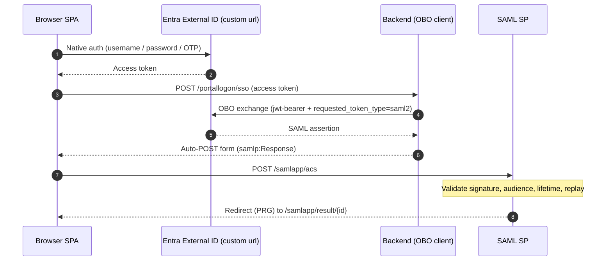

# CIAM Native Auth + OBO → SAML SSO Demo

A self-contained ASP.NET Core (.NET 9) application that demonstrates **Microsoft Entra External ID (CIAM)** native authentication in a browser SPA, followed by an **OAuth 2.0 On-Behalf-Of (OBO)** token exchange that produces a **SAML 2.0 assertion** and completes SSO into a SAML service provider — all within one app.

## What it demonstrates

1. **Native auth SPA** — A pre-built browser client signs the user in directly against Entra External ID (`<custom url>`) using the native authentication flow (username / password / OTP), with no redirect to a hosted login page.
2. **Backend OBO exchange** — The SPA posts the resulting access token to the backend, which performs a confidential-client OBO exchange requesting `requested_token_type=urn:ietf:params:oauth:token-type:saml2`.
3. **SAML SSO** — The backend wraps the returned SAML assertion in a `<samlp:Response>` and auto-POSTs it to the SAML Assertion Consumer Service (ACS). The SAML SP validates signature, audience, lifetime, and replay, then shows the result.

## Architecture



## Endpoints

| Path | Purpose |
| --- | --- |
| `/portallogon-direct/` | Native-auth SPA (static bundle in `wwwroot`) |
| `/portallogon/sso` | Backend OBO exchange → SAML auto-POST |
| `/samlapp/acs` | SAML Assertion Consumer Service |
| `/samlapp/result/{id}` | Post-Redirect-Get result page |
| `/samlapp/metadata` | SAML SP metadata |

## Project layout

- `Program.cs` — minimal host wiring (options binding, HTTP clients, CORS, static files, controllers)
- `Controllers/PortalLogonController.cs` — OBO exchange + SAML response assembly + auto-POST
- `Controllers/SamlController.cs` — SAML ACS, result, and metadata endpoints
- `Saml/` — SAML response processing, federation-metadata parsing, replay cache, result store
- `Configuration/DeploymentOptions.cs` — `Cors` and `PortalLogon` options
- `wwwroot/portallogon-direct/` — pre-built SPA bundle

## Configuration

All non-secret settings live in `appsettings.json` (`Cors`, `Saml`, `PortalLogon`). The file ships with **placeholder values** (e.g. `"<update your ... here, e.g. ...>"`) that you **must replace** with values for your own environment before running or deploying. Replace every placeholder — leaving the angle-bracket text in place will cause sign-in, OBO, or SAML validation to fail.

### Values to update at deployment

| Setting | What to set it to | Example |
| --- | --- | --- |
| `Cors:AllowedOrigins[0]` | Local dev frontend origin (http) | `http://localhost:5173` |
| `Cors:AllowedOrigins[1]` | Local dev frontend origin (https) | `https://localhost:5173` |
| `Cors:AllowedOrigins[2]` | Deployed portal base URL | `https://myportal.azurewebsites.net` |
| `Cors:AllowedOrigins[3]` | CIAM native auth host URL | `https://login.mydomain.com` |
| `Saml:ServiceProviderEntityId` | SAML service provider entity ID URL | `https://myportal.azurewebsites.net/samlapp` |
| `Saml:AssertionConsumerServiceUrl` | SAML assertion consumer service (ACS) URL | `https://myportal.azurewebsites.net/samlapp/acs` |
| `Saml:MetadataUrl` | Identity provider federation metadata URL | `https://mytenant.ciamlogin.com/<tenant-id>/federationmetadata/2007-06/federationmetadata.xml?appid=<app-id>` |
| `PortalLogon:NativeAuthHost` | Custom domain for your CIAM native auth host | `login.mydomain.com` |
| `PortalLogon:TenantId` | Tenant ID of your CIAM tenant | `12345678-1234-1234-1234-123456789abc` |
| `PortalLogon:OboClientId` | Client ID of your CIAM app registration for the OBO flow | `12345678-1234-1234-1234-123456789abc` |
| `PortalLogon:OboScope` | Scope for your CIAM app registration for the OBO flow | `api://12345678-1234-1234-1234-123456789abc/.default` |
| `PortalLogon:OboTokenUrl` | OAuth 2.0 on-behalf-of token endpoint URL | `https://login.mydomain.com/<tenant-id>/oauth2/v2.0/token` |
| `PortalLogon:AcsUrl` | SAML assertion consumer service (ACS) URL | `https://myportal.azurewebsites.net/samlapp/acs` |

> Keep `Saml:AssertionConsumerServiceUrl`, `PortalLogon:AcsUrl`, and the ACS path in `Saml:ServiceProviderEntityId` consistent — they must all point at the same deployed `/samlapp/acs` endpoint. `Cors:AllowedOrigins[2]`, `Saml:ServiceProviderEntityId`, and the ACS URLs all share the same deployed portal base URL.

When deploying to Azure App Service, override any of these per-environment values with application settings using the `Section__Key` convention (for example `PortalLogon__TenantId`) instead of editing the committed file.

The **OBO client secret is NOT stored in source.** Provide it at runtime via configuration override:

```bash
# Local development (do not commit)
setx PortalLogon__OboClientSecret "<your-obo-client-secret>"
```

On Azure App Service, set the application setting `PortalLogon__OboClientSecret`.

> **Production guidance:** For the purposes of this demo, the confidential-client credential (OBO client secret) is resolved from configuration and held **in memory** at runtime. In a production deployment, do **not** keep the client secret — or any other credential such as a signing/authentication **certificate** — in app settings, environment variables, or source. Store it in **Azure Key Vault** and access it via a managed identity (for example, using Key Vault references in App Service or the `Azure.Security.KeyVault` / `Azure.Identity` SDKs). Prefer **certificate-based** client credentials over shared secrets where possible, and rotate credentials regularly.

## Run locally

```bash
dotnet restore
dotnet run
# then open http://localhost:5000/portallogon-direct/
```

### Setup instructions

Follow these steps to download, configure, and run the application from GitHub.

1. **Clone the repository**

   ```bash
   git clone https://github.com/randeny/ciam.git
   cd ciam\saml_obo_portal
   ```

2. **Install the .NET 9 SDK** (if not already installed)

   Download from https://dotnet.microsoft.com/download/dotnet/9.0 and verify:

   ```bash
   dotnet --version
   ```

3. **Update `appsettings.json` placeholders**

   Open `saml_obo_portal/appsettings.json` and replace every `"<update your ... here, e.g. ...>"` placeholder in the `Cors`, `Saml`, and `PortalLogon` sections with the values for your environment. See the [Values to update at deployment](#values-to-update-at-deployment) table above.

4. **Provide the OBO client secret** (never commit this value)

   ```bash
   # macOS / Linux
   export PortalLogon__OboClientSecret="<your-obo-client-secret>"

   # Windows (PowerShell)
   $env:PortalLogon__OboClientSecret = "<your-obo-client-secret>"
   ```

5. **Restore and build**

   ```bash
   dotnet restore
   dotnet build
   ```

6. **Run the application**

   ```bash
   dotnet run
   ```

7. **Open the portal** in a browser:

   ```
   http://localhost:5000/portallogon-direct/
   ```

To deploy to Azure App Service instead, publish the app and set the `PortalLogon__OboClientSecret` application setting on the target web app:

```bash
dotnet publish -c Release -o ./publish
# then zip-deploy ./publish to your App Service
```

## Important note on CORS configuration

The native-auth SPA calls the Entra External ID native authentication endpoints (for example `/oauth2/v2.0/initiate`) **directly from the browser**. Because the SPA is served from a different origin than the authentication host (for example the app runs on `http://localhost:5000` locally, or on your web server, while the auth endpoints live on `<custom url>`), these are cross-origin requests and the browser enforces CORS. Entra External ID native-auth endpoints only return an `Access-Control-Allow-Origin` header for origins that are explicitly registered on the SPA app registration. If the requesting origin is not allowed, the browser discards the response and the SPA sign-in fails with **"Failed to fetch"**, even though the network tab may show the request returned `200 (OK)`. The console shows an error similar to:

```
Access to fetch at 'https://<custom url>/<tenant-id>/oauth2/v2.0/initiate' from origin 'http://localhost:5000'
has been blocked by CORS policy: No 'Access-Control-Allow-Origin' header is present on the requested resource.
```


### Using Azure Front Door as a CORS-rewriting proxy

When you front the application with a **custom domain**, you can route the native-auth calls through **Azure Front Door (AFD)** and have AFD act as a reverse proxy that rewrites the CORS headers. AFD sits in front of the Entra External ID custom domain (`<custom url>`) and, using a rule set, injects the CORS response headers the browser requires so the sign-in succeeds without changing the SPA or the client app.

The rule matches on the upstream request URL and the browser's `Origin`, then overwrites the response headers on the way back:

- **Condition** — `Request URL` *Contains* `<custom url>` **AND** `Request header` `Origin` *Contains* the allowed custom-domain origin (for example `https://<custom url>`).
- **Action** — Overwrite `Access-Control-Allow-Origin` with the custom-domain origin, and overwrite `Access-Control-Allow-Credentials` with `true`.


Additionally, the OBO client sends a **special header** that AFD can key off to **remove the request `Origin` header** before the call reaches the upstream Entra endpoint. Stripping `Origin` makes the upstream treat the request as non-CORS (same-origin), and AFD then adds the appropriate CORS response headers on the way back to the browser — giving you full control of the CORS contract at the edge.

## Requirements

- .NET 9 SDK
- An Entra External ID (CIAM) tenant with:
  - a native-auth public SPA client
  - a confidential client authorized for the OBO / SAML exchange
  - a SAML application registration whose federation metadata is referenced by `Saml:MetadataUrl`

## Security notes

- Secrets are supplied only through environment / app settings, never committed.
- SAML validation enforces signature, audience (`urn:example:ps-saml-app`), lifetime, and replay detection.
- The SAML audience is a URN, so audience validation is host-independent across environments.
