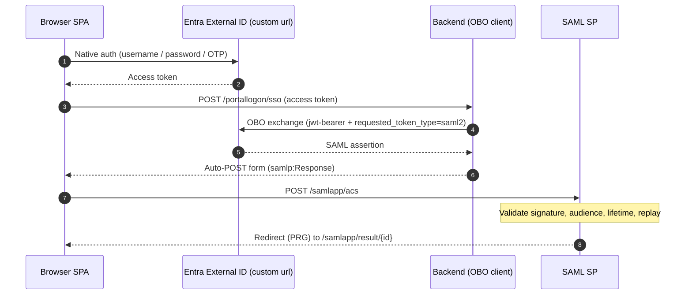
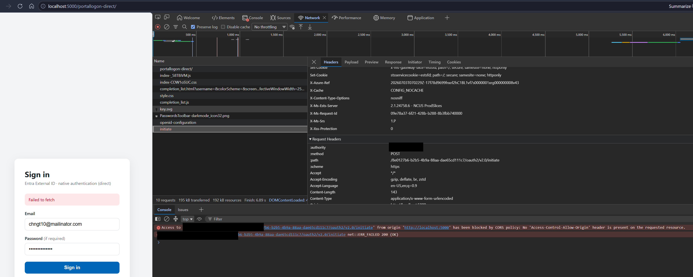
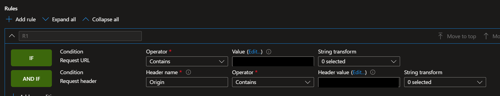
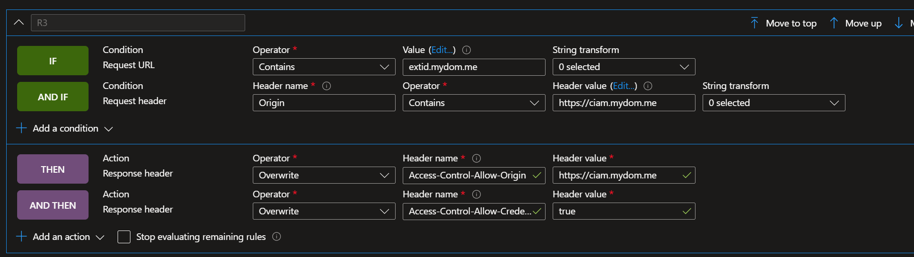

# CIAM Native Auth + OBO → SAML SSO Demo

A self-contained ASP.NET Core (.NET 9) application that demonstrates **Microsoft Entra External ID (CIAM)** native authentication in a browser SPA, followed by an **OAuth 2.0 On-Behalf-Of (OBO)** token exchange that produces a **SAML 2.0 assertion** and completes SSO into a SAML service provider — all within one app.

## What it demonstrates

1. **Native auth SPA** — A pre-built browser client signs the user in directly against Entra External ID (`<custom url>`) using the native authentication flow (username / password / OTP), with no redirect to a hosted login page.
2. **Backend OBO exchange** — The SPA posts the resulting access token to the backend, which performs a confidential-client OBO exchange requesting `requested_token_type=urn:ietf:params:oauth:token-type:saml2`.
3. **SAML SSO** — The backend wraps the returned SAML assertion in a `<samlp:Response>` and auto-POSTs it to the SAML Assertion Consumer Service (ACS). The SAML SP validates signature, audience, lifetime, and replay, then shows the result.

## Architecture



## Endpoints

| Path | Purpose |
| --- | --- |
| `/portallogon-direct/` | Native-auth SPA (static bundle in `wwwroot`) |
| `/portallogon/sso` | Backend OBO exchange → SAML auto-POST |
| `/samlapp/acs` | SAML Assertion Consumer Service |
| `/samlapp/result/{id}` | Post-Redirect-Get result page |
| `/samlapp/metadata` | SAML SP metadata |

## Project layout

- `Program.cs` — minimal host wiring (options binding, HTTP clients, CORS, static files, controllers)
- `Controllers/PortalLogonController.cs` — OBO exchange + SAML response assembly + auto-POST
- `Controllers/SamlController.cs` — SAML ACS, result, and metadata endpoints
- `Saml/` — SAML response processing, federation-metadata parsing, replay cache, result store
- `Configuration/DeploymentOptions.cs` — `Cors` and `PortalLogon` options
- `wwwroot/portallogon-direct/` — pre-built SPA bundle

## Solution components

This single ASP.NET Core app is really two cooperating pieces:

- **The portal / SPA application (required).** A browser single-page app (served from `wwwroot/portallogon-direct/`) backed by `PortalLogonController`. The SPA signs the user in directly against Entra External ID using native authentication (username / password / OTP, no redirect), then hands the resulting access token to the backend. The backend performs the confidential-client **On-Behalf-Of exchange** that turns that token into a **SAML 2.0 assertion** and auto-POSTs it onward. This is the heart of the demo and is always in play.
- **The sample SAML application (optional).** A minimal SAML 2.0 **service provider** implemented by `SamlController` and the helpers in `Saml/`, exposed under `/samlapp` (`/acs`, `/result/{id}`, `/metadata`). It exists so the demo is self-contained: it receives the SAML assertion the OBO step produces, validates it (signature, audience, lifetime, replay) against the IdP federation metadata, and renders the decoded claims. In a real deployment you would point the OBO step at your *own* SAML application instead — so this SP is a convenient stand-in you can drop once you wire in the real one.

## Prerequisites

Before you deploy, make sure you have all of the following. If you are new to Entra, do the [Entra External ID setup](#entra-external-id-setup-app-registrations) first — it produces most of the values you will paste into configuration.

| # | Requirement | Notes |
| --- | --- | --- |
| 1 | An **Azure subscription** | Needed only if you deploy to Azure App Service. Running locally does not require one. |
| 2 | A **Microsoft Entra External ID (CIAM) tenant** | Create one from **Microsoft Entra admin center → Identity → External Identities → create an external tenant**. This is *not* the same as a normal workforce tenant. |
| 3 | Permission to create app registrations | You need the **Application Administrator** (or **Global Administrator**) role in that tenant to register apps and grant admin consent. |
| 4 | The **.NET 9 SDK** | Download from <https://dotnet.microsoft.com/download/dotnet/9.0>. Verify with `dotnet --version`. |
| 5 | A code editor | Visual Studio 2022, VS Code, or Rider. |
| 6 | (Optional) A **custom domain** for the tenant | Native auth is called from the browser and is subject to CORS — a custom domain plus Azure Front Door is the recommended way to satisfy CORS in production. See [CORS configuration](#important-note-on-cors-configuration). |

## Entra External ID setup (app registrations)

This demo relies on **three** app registrations in your External ID tenant. Create them in the order below — later apps reference IDs produced by earlier ones. Every ID and URL you collect here maps to exactly one configuration key (see the [ID → configuration map](#id--configuration-map) at the end).

> The Entra admin center UI changes over time. The blade names below are current at the time of writing; if a menu has moved, use the search box in the admin center and refer to the official docs linked in each step.

### The three identities at a glance

| App registration | Type | Role in the flow | Feeds these settings |
| --- | --- | --- | --- |
| **A. Native-auth SPA** | Public client (SPA) | Signs the user in from the browser (username / password / OTP) and requests an access token for app **B**. | SPA bundle `clientId`, `metadataUrl`, `scope` (see [Updating the SPA](#updating-the-pre-built-spa-bundle)) |
| **B. OBO API (confidential client)** | Web / confidential client that also **exposes an API** | Receives the SPA's access token and performs the On-Behalf-Of exchange that returns a **SAML2 assertion**. | `PortalLogon:OboClientId`, `OboClientSecret`, `OboScope`, `OboTokenUrl` |
| **C. SAML application** | SAML-based app | The service provider the SAML assertion is *issued for*. Its federation metadata (signing cert + issuer) is what this app validates the assertion against. | `Saml:MetadataUrl`, `Saml:ExpectedAudience` |

### Step 1 — Register the SAML application (app C)

The SAML assertion has to be issued *for* something. That "something" is a SAML app registration whose **identifier / audience URI** the demo validates against (`Saml:ExpectedAudience`, shipped as `urn:example:ps-saml-app`).

1. In the Entra admin center of your External ID tenant, go to **Identity → Applications → App registrations → New registration**.
2. Name it e.g. `saml-obo-demo-sp`. Leave redirect URI blank. Register.
3. Open **Expose an API → Application ID URI** and set it to a stable URN that will be the **SAML audience**, e.g. `urn:example:ps-saml-app`. Save. (Use this exact value for `Saml:ExpectedAudience`, or change both together.)
4. Under **Manage → Authentication** (or the app's SAML/SSO configuration), record the **Application (client) ID** — you will need it for the metadata URL's `appid` query parameter.
5. Build the **federation metadata URL** for `Saml:MetadataUrl`:

   ```
   https://<tenant-subdomain>.ciamlogin.com/<tenant-id>/federationmetadata/2007-06/federationmetadata.xml?appid=<app-C-client-id>
   ```

   The app loads this URL to get the IdP signing certificate and issuer it uses to validate the assertion (see `Saml/FederationMetadataParser.cs`).

- Reference: [Configure SAML-based single sign-on](https://learn.microsoft.com/entra/identity-platform/) and your tenant's SAML/SSO documentation.

### Step 2 — Register the OBO API / confidential client (app B)

This is the middle-tier confidential client. It is **both** the API the SPA asks for a token *and* the client that performs the OBO exchange.

1. **App registrations → New registration**. Name it e.g. `saml-obo-demo-api`. Register.
2. Copy the **Application (client) ID** → this is `PortalLogon:OboClientId`.
3. **Expose an API**:
   - Set the **Application ID URI** to `api://<app-B-client-id>`.
   - **Add a scope** named `access` (admin-consent enough). The SPA will request `api://<app-B-client-id>/access`.
4. **Certificates & secrets → New client secret**. Copy the secret **value** immediately → this becomes `PortalLogon__OboClientSecret` (provided at runtime, **never committed** — see [Configuration](#configuration)).
5. Configure the OBO target so the exchange returns a **SAML2 token** for app **C** (the SAML SP). This is what lets the confidential client request `requested_token_type=urn:ietf:params:oauth:token-type:saml2` (see `Controllers/PortalLogonController.cs`). Grant this app permission to the SAML app / add it as an authorized client as required by your tenant.
6. Record the token endpoint for `PortalLogon:OboTokenUrl`:

   ```
   https://<native-auth-host>/<tenant-id>/oauth2/v2.0/token
   ```

7. Set `PortalLogon:OboScope` to `api://<app-B-client-id>/.default` (or the SAML resource scope your tenant requires).

- Reference: [OAuth 2.0 On-Behalf-Of flow](https://learn.microsoft.com/entra/identity-platform/v2-oauth2-on-behalf-of-flow).

### Step 3 — Register the native-auth SPA (app A)

This is the public client the browser uses to sign the user in without a redirect.

1. **App registrations → New registration**. Name it e.g. `saml-obo-demo-spa`.
2. Under **Authentication**, add a **Single-page application** platform and enable settings required for **native authentication** (enable public client / native auth for the app). Add your portal origin(s) as redirect URIs / SPA origins so CORS succeeds — the same origins you list in `Cors:AllowedOrigins`.
3. **API permissions → Add a permission → My APIs →** select app **B** and add the `access` delegated scope. Click **Grant admin consent**.
4. Copy the **Application (client) ID** → this is the SPA's `clientId` (baked into the bundle, see below).
5. Note your tenant's OpenID metadata URL for the SPA's `metadataUrl`:

   ```
   https://<native-auth-host>/<tenant-id>/v2.0/.well-known/openid-configuration
   ```

- Reference: [Native authentication](https://learn.microsoft.com/entra/external-id/customers/concept-native-authentication).

### Updating the pre-built SPA bundle

> **Important for novices:** the SPA in `wwwroot/portallogon-direct/` is a **pre-built JavaScript bundle** with a specific tenant's values **hard-coded** inside the minified `assets/*.js`. The shipped bundle contains:
>
> ```js
> const ge = {
>   clientId: "<app-A-spa-client-id>",                                             // app A (native-auth SPA)
>   metadataUrl: "https://<native-auth-host>/<tenant-id>/v2.0/.well-known/openid-configuration",
>   scope: "api://<app-B-client-id>/access openid offline_access",                 // app B's exposed scope
>   challengeType: "password oob redirect",
>   ssoEndpoint: "/portallogon/sso"
> };
> ```
>
> These are **not** read from `appsettings.json`. To point the SPA at *your* tenant you must replace `clientId`, `metadataUrl`, and `scope` with your app **A** client ID, your tenant metadata URL, and your app **B** scope. The SPA **source is not included in this repository**, so you must either rebuild the SPA from its own source with your values, or (for a quick local test only) edit the three literals directly in the minified bundle. Plan to rebuild for any real deployment.

### ID → configuration map

After completing steps 1–3, you will have collected the following. Paste each into the matching key.

| Value you collected | Goes into | Where |
| --- | --- | --- |
| App A (SPA) client ID | SPA `clientId` | bundle JS |
| Tenant OpenID metadata URL | SPA `metadataUrl` | bundle JS |
| `api://<app-B>/access …` | SPA `scope` | bundle JS |
| App B client ID | `PortalLogon:OboClientId` | `appsettings.json` |
| App B client secret | `PortalLogon__OboClientSecret` | env var / App Service setting |
| `api://<app-B>/.default` | `PortalLogon:OboScope` | `appsettings.json` |
| `.../oauth2/v2.0/token` | `PortalLogon:OboTokenUrl` | `appsettings.json` |
| Native-auth host | `PortalLogon:NativeAuthHost` | `appsettings.json` |
| Tenant ID | `PortalLogon:TenantId` | `appsettings.json` |
| App C audience URI (`urn:…`) | `Saml:ExpectedAudience` | `appsettings.json` |
| Federation metadata URL (with `appid`) | `Saml:MetadataUrl` | `appsettings.json` |
| Your portal origins | `Cors:AllowedOrigins` | `appsettings.json` |
| Deployed portal base + `/samlapp…` | `Saml:ServiceProviderEntityId`, `Saml:AssertionConsumerServiceUrl`, `PortalLogon:AcsUrl` | `appsettings.json` |

## Configuration

All non-secret settings live in `appsettings.json` (`Cors`, `Saml`, `PortalLogon`). The file ships with **placeholder values** (e.g. `"<update your ... here, e.g. ...>"`) that you **must replace** with values for your own environment before running or deploying. Replace every placeholder — leaving the angle-bracket text in place will cause sign-in, OBO, or SAML validation to fail.

### Values to update at deployment

| Setting | What to set it to | Example |
| --- | --- | --- |
| `Cors:AllowedOrigins[0]` | Local dev frontend origin (http) | `http://localhost:5173` |
| `Cors:AllowedOrigins[1]` | Local dev frontend origin (https) | `https://localhost:5173` |
| `Cors:AllowedOrigins[2]` | Deployed portal base URL | `https://myportal.azurewebsites.net` |
| `Cors:AllowedOrigins[3]` | CIAM native auth host URL | `https://login.mydomain.com` |
| `Saml:ServiceProviderEntityId` | SAML service provider entity ID URL | `https://myportal.azurewebsites.net/samlapp` |
| `Saml:AssertionConsumerServiceUrl` | SAML assertion consumer service (ACS) URL | `https://myportal.azurewebsites.net/samlapp/acs` |
| `Saml:MetadataUrl` | Identity provider federation metadata URL | `https://mytenant.ciamlogin.com/<tenant-id>/federationmetadata/2007-06/federationmetadata.xml?appid=<app-id>` |
| `PortalLogon:NativeAuthHost` | Custom domain for your CIAM native auth host | `login.mydomain.com` |
| `PortalLogon:TenantId` | Tenant ID of your CIAM tenant | `12345678-1234-1234-1234-123456789abc` |
| `PortalLogon:OboClientId` | Client ID of your CIAM app registration for the OBO flow | `12345678-1234-1234-1234-123456789abc` |
| `PortalLogon:OboScope` | Scope for your CIAM app registration for the OBO flow | `api://12345678-1234-1234-1234-123456789abc/.default` |
| `PortalLogon:OboTokenUrl` | OAuth 2.0 on-behalf-of token endpoint URL | `https://login.mydomain.com/<tenant-id>/oauth2/v2.0/token` |
| `PortalLogon:AcsUrl` | SAML assertion consumer service (ACS) URL | `https://myportal.azurewebsites.net/samlapp/acs` |

> Keep `Saml:AssertionConsumerServiceUrl`, `PortalLogon:AcsUrl`, and the ACS path in `Saml:ServiceProviderEntityId` consistent — they must all point at the same deployed `/samlapp/acs` endpoint. `Cors:AllowedOrigins[2]`, `Saml:ServiceProviderEntityId`, and the ACS URLs all share the same deployed portal base URL.

When deploying to Azure App Service, override any of these per-environment values with application settings using the `Section__Key` convention (for example `PortalLogon__TenantId`) instead of editing the committed file.

The **OBO client secret is NOT stored in source.** Provide it at runtime via configuration override:

```bash
# Local development (do not commit)
setx PortalLogon__OboClientSecret "<your-obo-client-secret>"
```

On Azure App Service, set the application setting `PortalLogon__OboClientSecret`.

> **Production guidance:** For the purposes of this demo, the confidential-client credential (OBO client secret) is resolved from configuration and held **in memory** at runtime. In a production deployment, do **not** keep the client secret — or any other credential such as a signing/authentication **certificate** — in app settings, environment variables, or source. Store it in **Azure Key Vault** and access it via a managed identity (for example, using Key Vault references in App Service or the `Azure.Security.KeyVault` / `Azure.Identity` SDKs). Prefer **certificate-based** client credentials over shared secrets where possible, and rotate credentials regularly.

## Run locally

```bash
dotnet restore
dotnet run
# then open http://localhost:5000/portallogon-direct/
```

### Setup instructions

Follow these steps to download, configure, and run the application from GitHub. If you are new to Entra, complete the [Prerequisites](#prerequisites) and [Entra External ID setup](#entra-external-id-setup-app-registrations) first — they produce the IDs, URLs, and secret used below.

1. **Clone the repository**

   ```bash
   git clone https://github.com/randeny/ciam.git
   cd ciam\saml_obo_portal
   ```

2. **Install the .NET 9 SDK** (if not already installed)

   Download from https://dotnet.microsoft.com/download/dotnet/9.0 and verify:

   ```bash
   dotnet --version
   ```

3. **Create the Entra app registrations**

   Complete [Entra External ID setup](#entra-external-id-setup-app-registrations) (three app registrations) and collect the values from the [ID → configuration map](#id--configuration-map).

4. **Point the SPA bundle at your tenant**

   Update `clientId`, `metadataUrl`, and `scope` in the pre-built SPA — see [Updating the pre-built SPA bundle](#updating-the-pre-built-spa-bundle).

5. **Update `appsettings.json` placeholders**

   Open `saml_obo_portal/appsettings.json` and replace every `"<update your ... here, e.g. ...>"` placeholder in the `Cors`, `Saml`, and `PortalLogon` sections with the values for your environment. See the [Values to update at deployment](#values-to-update-at-deployment) table above.

6. **Provide the OBO client secret** (never commit this value)

   ```bash
   # macOS / Linux
   export PortalLogon__OboClientSecret="<your-obo-client-secret>"

   # Windows (PowerShell)
   $env:PortalLogon__OboClientSecret = "<your-obo-client-secret>"
   ```

7. **Restore and build**

   ```bash
   dotnet restore
   dotnet build
   ```

8. **Run the application**

   ```bash
   dotnet run
   ```

9. **Open the portal** in a browser:

   ```
   http://localhost:5000/portallogon-direct/
   ```

To deploy to Azure App Service instead, publish the app and set the `PortalLogon__OboClientSecret` application setting on the target web app:

```bash
dotnet publish -c Release -o ./publish
# then zip-deploy ./publish to your App Service
```

See [Deploy the sample to Azure App Service (optional)](#deploy-the-sample-to-azure-app-service-optional) below for full, step-by-step instructions.

## Deploy the sample to Azure App Service (optional)

> **Optional.** Running the app [locally](#run-locally) is enough to try the end-to-end flow. Follow this section only if you want the sample reachable at a public HTTPS URL (which also makes the SAML ACS, native-auth, and CORS behavior representative of a real deployment). These steps deploy the **whole sample** — which includes the SAML service provider under `/samlapp` — as a single Azure App Service web app.

### Prerequisites for this section

- An **Azure subscription**.
- The **Azure CLI** — install from <https://learn.microsoft.com/cli/azure/install-azure-cli>, then sign in:

  ```bash
  az login
  az account set --subscription "<your-subscription-id-or-name>"
  ```

- The [.NET 9 SDK](https://dotnet.microsoft.com/download/dotnet/9.0) (to publish the app).
- Your completed [Entra External ID setup](#entra-external-id-setup-app-registrations) values, including the **OBO client secret**.

Pick names/region and reuse them in the commands below (bash — for PowerShell, swap the `\` line-continuations for backticks):

```bash
RG="rg-saml-obo-demo"
LOCATION="eastus"
PLAN="plan-saml-obo-demo"
APP="saml-obo-demo-$RANDOM"   # must be globally unique; becomes https://<APP>.azurewebsites.net
```

### Step 1 — Create the App Service (Linux, .NET 9)

```bash
az group create --name "$RG" --location "$LOCATION"

az appservice plan create \
  --name "$PLAN" --resource-group "$RG" \
  --location "$LOCATION" --sku B1 --is-linux

az webapp create \
  --name "$APP" --resource-group "$RG" \
  --plan "$PLAN" --runtime "DOTNETCORE:9.0"

# Enforce HTTPS (the SAML POST and native-auth calls should never travel over http)
az webapp update --name "$APP" --resource-group "$RG" --https-only true
```

Your portal base URL is now `https://<APP>.azurewebsites.net`. Use it consistently for every "portal base URL" value below.

### Step 2 — Configure application settings

Set every environment-specific value as an App Service application setting using the `Section__Key` convention (double underscore) instead of editing `appsettings.json`. **The OBO client secret must only be provided this way — never committed.**

```bash
BASE="https://$APP.azurewebsites.net"

az webapp config appsettings set --name "$APP" --resource-group "$RG" --settings \
  PortalLogon__TenantId="<tenant-id>" \
  PortalLogon__NativeAuthHost="<native-auth-host>" \
  PortalLogon__OboClientId="<app-B-client-id>" \
  PortalLogon__OboScope="api://<app-B-client-id>/.default" \
  PortalLogon__OboTokenUrl="https://<native-auth-host>/<tenant-id>/oauth2/v2.0/token" \
  PortalLogon__AcsUrl="$BASE/samlapp/acs" \
  PortalLogon__OboClientSecret="<your-obo-client-secret>" \
  Saml__ServiceProviderEntityId="$BASE/samlapp" \
  Saml__AssertionConsumerServiceUrl="$BASE/samlapp/acs" \
  Saml__ExpectedAudience="<app-C-audience-uri, e.g. urn:example:ps-saml-app>" \
  Saml__MetadataUrl="https://<native-auth-host>/<tenant-id>/federationmetadata/2007-06/federationmetadata.xml?appid=<app-C-client-id>" \
  Cors__AllowedOrigins__0="$BASE" \
  Cors__AllowedOrigins__1="https://<native-auth-host>"
```

> Keep `Saml__AssertionConsumerServiceUrl`, `PortalLogon__AcsUrl`, and the ACS path implied by `Saml__ServiceProviderEntityId` all pointing at `$BASE/samlapp/acs`. Array settings use zero-based `__index` keys (for example `Cors__AllowedOrigins__0`). For production, store `OboClientSecret` in **Azure Key Vault** and reference it here — see the [production guidance](#configuration) note.

### Step 3 — Publish the app

```bash
cd saml_obo_portal
dotnet publish -c Release -o ./publish

# Zip-deploy the published output
Compress-Archive -Path ./publish/* -DestinationPath ./publish.zip -Force   # PowerShell
# (bash/macOS/Linux:  cd publish && zip -r ../publish.zip . && cd .. )

az webapp deploy \
  --name "$APP" --resource-group "$RG" \
  --src-path ./publish.zip --type zip
```

### Step 4 — Wire the deployed URL back into Entra and the SPA

Because the app is now on a new origin, update the pieces that reference it:

1. **Native-auth SPA app registration (app A)** — add `https://<APP>.azurewebsites.net` as an allowed **SPA redirect URI / origin** so browser native-auth calls pass CORS (see [CORS configuration](#important-note-on-cors-configuration)).
2. **SPA bundle** — rebuild/update `metadataUrl`, `clientId`, and `scope` for your tenant if you have not already (see [Updating the pre-built SPA bundle](#updating-the-pre-built-spa-bundle)) and re-publish.
3. **SAML application (app C)** — make sure its expected ACS / reply URL matches `https://<APP>.azurewebsites.net/samlapp/acs` and its audience matches `Saml__ExpectedAudience`.

### Step 5 — Verify

```bash
# SP metadata should render with your deployed Entity ID and ACS URL
curl -s "https://$APP.azurewebsites.net/samlapp/metadata"
```

Then open `https://<APP>.azurewebsites.net/portallogon-direct/` in a browser and complete a sign-in. The ACS info page at `/samlapp/acs` (GET) shows the effective SP configuration for quick troubleshooting.

To tear everything down:

```bash
az group delete --name "$RG" --yes --no-wait
```

## Important note on CORS configuration

The native-auth SPA calls the Entra External ID native authentication endpoints (for example `/oauth2/v2.0/initiate`) **directly from the browser**. Because the SPA is served from a different origin than the authentication host (for example the app runs on `http://localhost:5000` locally, or on your web server, while the auth endpoints live on `<custom url>`), these are cross-origin requests and the browser enforces CORS. Entra External ID native-auth endpoints only return an `Access-Control-Allow-Origin` header for origins that are explicitly registered on the SPA app registration. If the requesting origin is not allowed, the browser discards the response and the SPA sign-in fails with **"Failed to fetch"**, even though the network tab may show the request returned `200 (OK)`. The console shows an error similar to:

```
Access to fetch at 'https://<custom url>/<tenant-id>/oauth2/v2.0/initiate' from origin 'http://localhost:5000'
has been blocked by CORS policy: No 'Access-Control-Allow-Origin' header is present on the requested resource.
```



### Using Azure Front Door as a CORS-rewriting proxy

When you front the application with a **custom domain**, you can route the native-auth calls through **Azure Front Door (AFD)** and have AFD act as a reverse proxy that rewrites the CORS headers. AFD sits in front of the Entra External ID custom domain (`<custom url>`) and, using a rule set, injects the CORS response headers the browser requires so the sign-in succeeds without changing the SPA or the client app.

The rule matches on the upstream request URL and the browser's `Origin`, then overwrites the response headers on the way back:

- **Condition** — `Request URL` *Contains* `<custom url>` **AND** `Request header` `Origin` *Contains* the allowed custom-domain origin (for example `https://<custom url>`).
- **Action** — Overwrite `Access-Control-Allow-Origin` with the custom-domain origin, and overwrite `Access-Control-Allow-Credentials` with `true`.





Additionally, the OBO client sends a **special header** that AFD can key off to **remove the request `Origin` header** before the call reaches the upstream Entra endpoint. Stripping `Origin` makes the upstream treat the request as non-CORS (same-origin), and AFD then adds the appropriate CORS response headers on the way back to the browser — giving you full control of the CORS contract at the edge.

## Requirements

- .NET 9 SDK
- An Entra External ID (CIAM) tenant with the **three app registrations** described in [Entra External ID setup](#entra-external-id-setup-app-registrations):
  - **A** — a native-auth public SPA client
  - **B** — a confidential client that exposes an API and is authorized for the OBO / SAML exchange
  - **C** — a SAML application whose federation metadata is referenced by `Saml:MetadataUrl`
- The pre-built SPA bundle updated with your tenant's values (see [Updating the pre-built SPA bundle](#updating-the-pre-built-spa-bundle))

## Security notes

- Secrets are supplied only through environment / app settings, never committed.
- SAML validation enforces signature, audience (`urn:example:ps-saml-app`), lifetime, and replay detection.
- The SAML audience is a URN, so audience validation is host-independent across environments.
